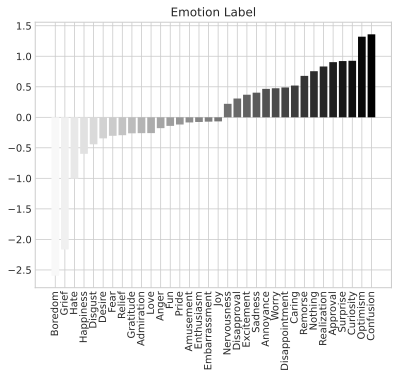

# twemo
Twitter emotion detection using PyTorch. Built with Python 3.9.5 and Torch 1.11.0 and Tweepy 4.9.0. Based on the text classification model provided in [this example](https://pytorch.org/tutorials/beginner/text_sentiment_ngrams_tutorial.html).
# Install (only linux)
1. Download the requirements:
	`pip install -r requirements.txt`
2. Replace your Twitter API keys in the vars.py file:
	`access_token_secret = 'Your key goes here'`
3. Specify a directory for the dataset files:
	`csvdir = 'home/twemo/datasets'`
4. Run:
	`python /twemo`
# Usage
1. Get tweets:
	Allows you to get tweet-emotion pairs into the dataset.csv file. You can specify an arbitrary amount of emotion labels for the model to  train with by 		modifying/extending the `emotion_labels` variable.
2. Create/Update Dataset:
	Creates the test.csv and train.csv split randomly given a specific ratio.
3. Train:
	Trains the model on the provided test.csv and train.csv files and uses the resulting model to predict the emotion of a test character string. Also this 	saves a `model.pt` file for later inference. 
4. Predict tweet:
	Prompts for any tweet URL to fetch the tweet text and run the model against it. Outputs the highest tensor as the prediction of what the emotion of the  	 text would be. Additionally it prints the output of all tensors.
